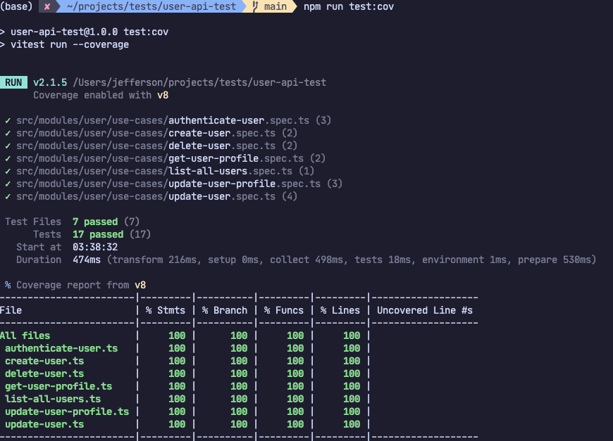

# User API

## Requirements

- Node.js
- Docker with docker-compose

## Instructions

1. Copy `.env.example` file to `.env`
2. Run `docker compose up -d` to run mysql database
3. Run `npm install` to install dependencies
4. Run `npm run db:migrate` to run database migrations
5. RUN `npm run lint` to check linting
6. RUN `npm run test:cov` to check test and coverage
7. RUN `npm run dev` to execute in development mode (listening at http://localhost:8000)
8. RUN `npm run build` to build a production distribution
9. RUN `npm start` to execute in production mode

## Test Coverage

## API Reference

OpenAPI Spec in http://localhost:8000/api-docs

## Stack

- Language: Typescript
- Framework: Fastify
- Unit tests: Vitest
- Schema Validation: Zod
- Database: MySQL
